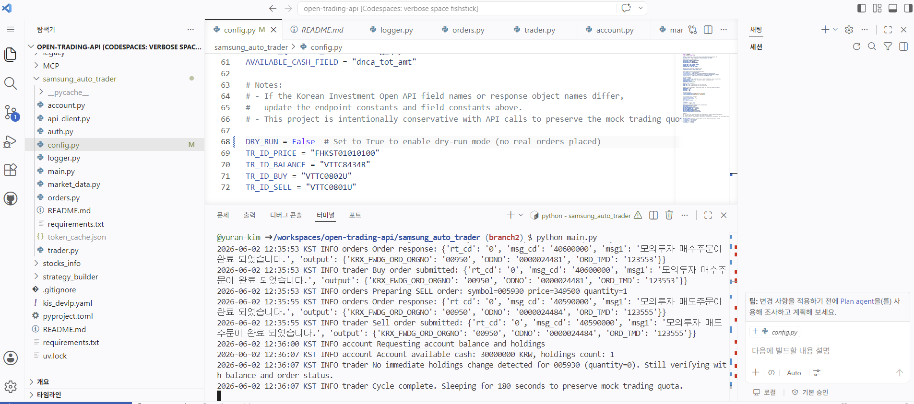

# Samsung Auto Trader

한국투자증권 Open API의 모의투자 환경을 이용하여 삼성전자(`005930`)를 대상으로 자동매매를 수행하는 Python 프로그램입니다.

이 프로젝트는 GitHub Codespaces에서 실행되도록 구성했으며, REST API만 사용합니다. WebSocket은 사용하지 않았고, 모의투자 환경에서만 동작하도록 설계했습니다.

## 주요 기능

* 한국투자증권 Open API 모의투자 서버 사용
* 삼성전자(`005930`) 현재가 조회
* 모의투자 계좌의 예수금 및 보유 종목 조회
* 현재가 기준 `-1,000원` 매수 주문 생성
* 현재가 기준 `+1,000원` 매도 주문 생성
* 주문 후 잔고를 다시 조회하여 체결 여부 확인
* 토큰을 발급받은 뒤 같은 날에는 캐시된 토큰 재사용
* 한국 시간(KST) 기준 `09:10 ~ 15:30` 사이에만 실행
* `DRY_RUN` 모드를 통해 실제 주문 없이 테스트 가능
* 모든 주요 동작을 로그로 출력

## 사용 환경

* Python
* requests
* GitHub Codespaces
* Korea Investment & Securities Open API
* Mock Trading Environment

## 폴더 구조

```text
samsung_auto_trader/
├── main.py
├── config.py
├── auth.py
├── api_client.py
├── market_data.py
├── account.py
├── orders.py
├── trader.py
├── logger.py
├── requirements.txt
└── README.md
```

## 파일 설명

* `main.py`: 프로그램 실행 진입점
* `config.py`: API 주소, 종목코드, 거래시간, 주문 간격, TR ID 등 설정값 관리
* `auth.py`: Access Token 발급 및 당일 토큰 캐싱
* `api_client.py`: GET/POST 요청, timeout, retry 처리
* `market_data.py`: 삼성전자 현재가 조회
* `account.py`: 계좌 예수금 및 보유 종목 조회
* `orders.py`: 매수/매도 주문 요청 생성 및 전송
* `trader.py`: 전체 자동매매 흐름 관리
* `logger.py`: KST 기준 로그 출력 설정

## 환경변수 설정

계좌번호, AppKey, AppSecret은 코드에 직접 작성하지 않고 GitHub Codespace Secrets에 저장했습니다.

필요한 환경변수는 다음과 같습니다.

```text
GH_ACCOUNT
GH_APPKEY
GH_APPSECRET
```

## 실행 방법

```bash
cd samsung_auto_trader
pip install -r requirements.txt
python main.py
```

## 거래 로직

프로그램은 삼성전자 현재가를 조회한 뒤 다음과 같이 주문 가격을 계산합니다.

```text
매수 주문가 = 현재가 - 1,000원
매도 주문가 = 현재가 + 1,000원
```

주문 가격은 호가 단위에 맞게 조정됩니다.

## DRY_RUN 모드

`config.py`에서 다음 값을 조정할 수 있습니다.

```python
DRY_RUN = True
```

`True`이면 실제 주문 요청을 보내지 않고, 주문 요청 내용을 로그로만 출력합니다.

```python
DRY_RUN = False
```

`False`이면 한국투자증권 모의투자 API로 실제 모의주문 요청을 전송합니다.

## 실행 결과

아래 화면은 GitHub Codespaces 터미널에서 프로그램을 실행한 결과입니다.



실행 로그에서 삼성전자 현재가 조회, 계좌 예수금 조회, 매수 주문 요청, 매도 주문 요청이 순서대로 수행되는 것을 확인할 수 있습니다. 로그 시간은 한국 시간(KST) 기준으로 표시됩니다.

## 주의사항

이 프로그램은 실전투자용이 아니라 한국투자증권 모의투자 환경에서 테스트하기 위한 프로그램입니다. 실제 계좌 정보와 AppKey/AppSecret은 코드에 포함하지 않았으며, GitHub Codespace Secrets를 통해 불러오도록 구성했습니다.