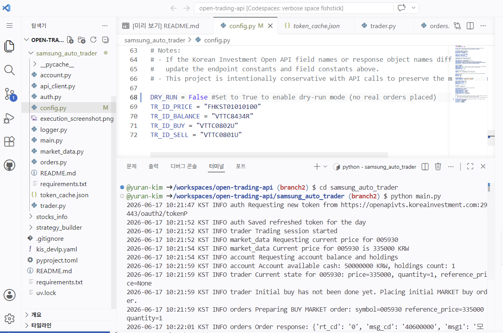
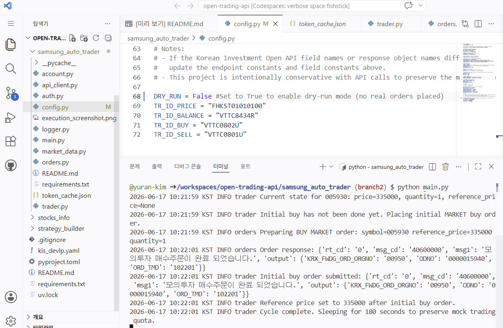
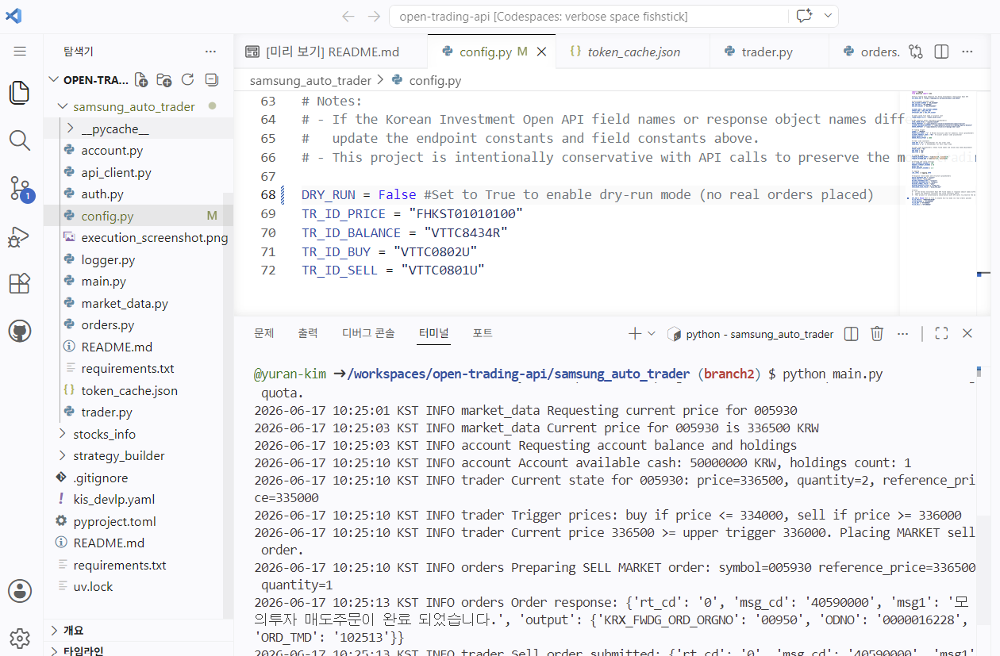
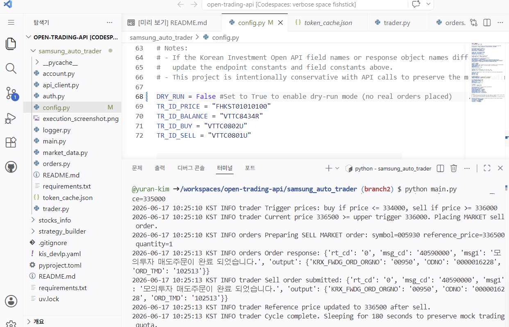

# Samsung Auto Trader

한국투자증권 Open API(KIS Open API)를 활용하여 삼성전자(005930)를 자동으로 거래하는 프로그램이다.

본 프로젝트는 GitHub Codespaces 환경에서 개발되었으며, REST API 기반으로 현재가 조회, 계좌 조회, 주문 실행, 주문 결과 확인 기능을 구현하였다.

---

# 1. 프로젝트 개요

Samsung Auto Trader는 한국투자증권 Open API를 이용하여 삼성전자(005930)를 자동으로 거래하는 프로그램이다.

프로그램은 현재 주가를 지속적으로 조회하며, 기준 가격(reference price)을 중심으로 자동으로 매수·매도 주문을 수행한다.

주요 기능은 다음과 같다.

* OAuth2 기반 토큰 인증
* 현재가 조회
* 계좌 및 보유 종목 조회
* 시장가 매수/매도 주문
* 자동 거래 로직 수행
* KST(한국 표준시) 로그 출력
* API 재시도(Retry) 및 예외 처리

---

# 2. 개발 환경

| 항목             | 내용                        |
| -------------- | ------------------------- |
| Language       | Python 3                  |
| API            | Korea Investment Open API |
| Environment    | GitHub Codespaces         |
| Target Stock   | 삼성전자 (005930)             |
| Trading Type   | 모의투자                      |
| Order Type     | 시장가 주문                    |
| Authentication | OAuth2 Access Token       |

---

# 3. 실행 방법

## 3.1 라이브러리 설치

```bash
pip install -r requirements.txt
```

## 3.2 GitHub Secrets 설정

프로그램은 계좌번호 및 API Key를 환경변수로 관리한다.

필요한 Secrets는 다음과 같다.

```text
GH_ACCOUNT
GH_APPKEY
GH_APPSECRET
```

## 3.3 프로그램 실행

```bash
cd samsung_auto_trader

python main.py
```

---

# 4. 거래 로직

## 최초 실행

프로그램이 처음 실행되면 현재가를 조회한 뒤 시장가로 1주를 매수한다.

예시

```text
현재가 = 335,000원

시장가 매수

reference_price = 335,000
```

매수 이후 해당 가격을 기준가격(reference price)으로 저장한다.

---

## 기준가격 기반 자동 거래

프로그램은 이후 주기적으로 현재가를 조회하며 다음 조건을 확인한다.

### 매도 조건

```text
현재가 >= 기준가격 + 1000원
```

조건이 충족되면 시장가 매도 주문을 실행한다.

예시

```text
기준가격 = 335,000

현재가 = 336,500

→ 시장가 매도
```

---

### 매수 조건

```text
현재가 <= 기준가격 - 1000원
```

조건이 충족되면 시장가 매수 주문을 실행한다.

예시

```text
기준가격 = 335,000

현재가 = 334,000

→ 시장가 매수
```

---

## 기준가격 갱신

매수 또는 매도가 발생하면 현재 가격으로 기준가격을 다시 설정한다.

```text
reference_price = 현재가
```

---

# 5. 프로그램 구조

```text
samsung_auto_trader/

├── main.py
├── config.py
├── auth.py
├── api_client.py
├── market_data.py
├── account.py
├── orders.py
├── trader.py
├── logger.py
├── token_cache.json
├── requirements.txt
└── README.md
```

---

# 6. 파일별 기능 설명

## main.py

프로그램 시작 파일

주요 기능

* 토큰 인증
* API Client 생성
* Trading Session 실행

---

## config.py

프로그램 설정 파일

주요 설정

* API Endpoint
* 거래 종목
* 거래 시간
* 가격 기준(1000원)
* TR_ID
* DRY_RUN 설정

---

## auth.py

인증 및 토큰 관리 모듈

주요 기능

* OAuth 토큰 발급
* 토큰 저장
* 당일 토큰 재사용
* 인증 실패 재시도

주요 함수

```python
authenticate()
request_token()
```

---

## api_client.py

Open API 통신 모듈

주요 기능

* GET 요청
* POST 요청
* Retry 처리
* Timeout 처리

주요 함수

```python
get()
post()
_request()
```

---

## market_data.py

현재가 조회 모듈

주요 함수

```python
get_current_price()
```

기능

* 삼성전자 현재가 조회

---

## account.py

계좌 조회 모듈

주요 함수

```python
get_account_summary()
get_symbol_holding()
```

기능

* 예수금 조회
* 보유 종목 조회
* 특정 종목 보유 수량 확인

---

## orders.py

주문 처리 모듈

주요 함수

```python
place_buy_order()
place_sell_order()
```

기능

* 시장가 매수 주문
* 시장가 매도 주문

---

## trader.py

자동매매 핵심 로직

주요 기능

* 현재가 조회
* 기준가격 관리
* 매수 조건 확인
* 매도 조건 확인
* 자동 주문 실행

---

## logger.py

로그 출력 모듈

주요 기능

* KST 시간 출력
* INFO 로그 기록

예시

```text
2026-06-17 10:25:13 KST INFO trader Sell order submitted
```

---

# 7. 실행 결과

## (1) 프로그램 시작 및 최초 매수



설명

* 현재가 조회
* 계좌 조회
* 최초 시장가 매수 수행

---

## (2) 최초 매수 완료 및 기준가격 설정



설명

* 시장가 매수 성공
* 주문번호 생성
* 기준가격(reference price) 저장

---

## (3) 매도 조건 충족



설명

* 현재가가 기준가격보다 1000원 이상 상승
* 매도 조건 발생

---

## (4) 시장가 매도 완료



설명

* 시장가 매도 성공
* 기준가격 갱신

---

# 8. 구현 과정에서 해결한 문제

## 한국 시간(KST) 출력

GitHub Codespaces는 기본적으로 UTC를 사용한다.

이를 해결하기 위해 Python의 ZoneInfo를 이용하여 모든 로그를 KST 기준으로 출력하도록 수정하였다.

```python
ZoneInfo("Asia/Seoul")
```

---

## 토큰 재사용

프로그램 실행 시마다 인증 요청을 보내지 않도록 token_cache.json 파일을 이용하여 동일 날짜의 토큰을 재사용하도록 구현하였다.

---

## API 예외 처리

한국투자증권 API는 간헐적으로 응답 지연이 발생한다.

이를 해결하기 위해 Retry 및 Backoff 기능을 구현하였다.

```python
RETRY_MAX = 3
RETRY_BACKOFF_SECONDS = 2.0
```

---

# 9. 결론

본 프로젝트에서는 한국투자증권 Open API를 활용하여 삼성전자 자동매매 프로그램을 구현하였다.

현재가 조회, 계좌 조회, 시장가 주문, 토큰 관리, 예외 처리, 기준가격 기반 자동매매 로직을 구현하였으며 실제 모의투자 환경에서 정상적으로 매수 및 매도 주문이 수행되는 것을 확인하였다.

이를 통해 Open API 기반 자동매매 시스템의 기본 구조를 이해하고 구현할 수 있었다.
